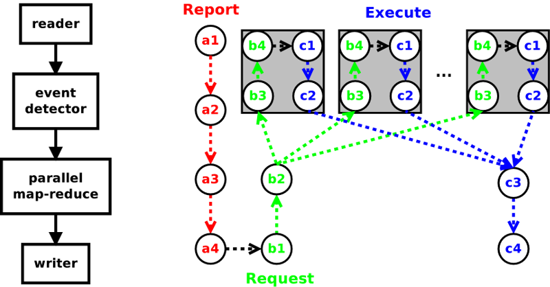

# DAGR
DAGR is a scalable framework for implementing analysis pipelines using parallel
design patterns. DAGR abstracts the pipeline concept into a state machine
composed of connected algorithmic units. Each algorithmic unit is written to do
a single task resulting in highly modularized, reusable code. **DAGR provides
infrastructure for control, communication, and parallelism, you provide the
kernels to implement your analyses.**

Written in modern C++ and designed to leverage MPI+threading for parallelism,
DAGR can leverage the latest HPC hardware including many-core architectures and
GPUs. The framework supports a number of parallel design patterns including
distributed data, map-reduce, and task based parallelism.

Python bindings expose optimized C++ code to those who prefer the rapid
development of Python. In addition DAGR is extensible via C, C++, Fortran,
or Python. Algorithms written natively in Python are parallelized over MPI, by
adding a single statement to the code.

[](https://travis-ci.org/LBL-EESA/dagr)

## Quick links
1. [DAGR Concepts](#dagr-concepts)
    1. [The pipeline state machine](#the-pipeline-state-machine)
    2. [The algorithm](#the-algorithm)
    3. [Metadata](#metadata)
    4. [The data model](#the-data-model)
    5. [Parallelism](#parallelism)
    6. [Python](#python)
2. [Writing DAGR algorithms](#writing-dagr-algorithms)
    1. [Report phase](#report-phase)
    2. [Request phase](#request-phase)
    3. [Execute phase](#execute-phase)
3. [An Example](#an-example)
    1. [Pipeline Construction, Configuration and Execution](#pipeline-construction-configuration-and-execution)
    2. [Listing 1: A command line application](#listing-1-a-command-line-application)
    3. [Listing 2: Writing a new algorithm via delegation](#listing-2-writing-a-new-algorithm-via-delegation)
4. [Copyright Notice](#copyright-notice)

## DAGR Concepts
### The pipeline state machine
The DAGR framework is based on a pipeline pattern. DAGR's pipeline is a state
machine with 3 states.

1. Report -- starting from the top, each algorithm reports the data it provides
2. Request -- starting from the bottom, each algorithm request specific data it needs to execute, usually a subset of what's available.
3. Execute -- starting from the top down, each algorithm executes, producing data requested of it, or performing a specific task such as I/O.

These three states give DAGR the flexibility to be highly efficient. Data is
can be advertised before it is accessed allowing for targetted subsetting. This
subsetting is the heart of implementing parallel design patterns such as
map-reduce and distributed data parallelism.

### The algorithm
The DAGR pipeline is implemented via object oriented design that abstracts the
"algorithm" concept. The [DAGR algorithm](core/dagr_algorithm.h) is the unit
from which complex analysis pipelines are constructed. It  provides the API for
connecting other algorithms together to form complex pipelines. It implements
the state machine logic. It provides hooks for developers to write new
algorithms via C++ polymorphism.

DAGR also provides a [prgrammable algorithm](alg/dagr_programmable_algorithm.h)
as an alternative to extending via polymorphism. The programmable algorithm
instead is given "callables", such as a C function pointer or C++ functor, that
handle each of the pipeline states. In many cases only the execute method need
be used.

### Metadata
During pipeline execution data proucers first advertize data they can provide,
data consumers then request specific data, before any heavy computational work
is done. The advertizing and requesting of data is accomplished via [DAGR
metadata](core/dagr_metadata.h) objects. Metadata objects are associative
container mapping string based keys to values, where values can be scalars,
arrays of POD types, strings, or nested DAGR metadata objects.  Nesting
metadata objects allows for the representation of higherarchical structures.

With this approach DAGR provides the mechanism for inter-algorithm communication
and coordination but the details are specified at the application level. In so
doing DAGR can handle a more diverse set of use cases and is not hardwired for
one specific application.

For example, during report phase of execution an I/O algorithm could advertise
the variables stored in a file by providing a key named "vars" mapping to an
array of strings identifying the variables. A data consumer could then request
a subset of those variables by adding the "vars" key and an array of strings
naming the desired variables into a request metadata object. This enables
minimal I/O and provides the mechanism for partitioning work in parallel
execution.

### The data model
To make possible the inter-algorithm exchange of data DAGR defines an array
based data model. In DAGR dataset types must derive from
[DAGR dataset](core/dagr_dataset.h).  DAGR ships with a number of common datasets
such as [tabular](data/dagr_table.h) and [mesh](data/dagr_cartesian_mesh.h) and
can be extended using polymorphism.

DAGR datasets are at the highest level collections of
[arrays](core/dagr_variant_array.h). DAGR arrays use polymorphism to implement
type-errassure so that arrays of different type can be contained in the same
collection. The concrete implementation of DAGR arrays are templated enabling
compilers to apply optimizations to computations on the arrays.

### Parallelism
DAGR is designed for parallel HPC based application development. Parallelism is
achieved by each thread making a request for a unique subset of the available
data. The requests are then processed in parallel. DAGR supports any combination
of MPI, threads, and GPUs.

DAGR ships with a map-reduce implementation. Data is advertised using a "map
index". The map indices are assigned to MPI ranks. Within each rank requests
for each index are pushed on to a thread-safe queue. An internal thread-pool
pops requests and executes them in parallel. In traditional 3D mesh based
applications each thread will request a block or blocks of data so that the
entire mesh is distributed across ranks and threads.

### Python
DAGR is written primarily in C++11 in order to deliver the highest possible
performance and scalability. However, for non-computer scientists C++11
development can be intimidating, error prone, and time consuming. DAGR's Python
bindings offer a more approachable path for custom application and algorithm
development.

Python can be viewed as glue for connecting optimized C++11 components. Using
Python as glue gives one all of the convenience and flexibility of Python
scripting with all of the performance of the native C++11 code. DAGR also
includes a path for fully Python based algorithm development where the
programmer provides Python callables that implement the desired analysis. In
this scenario the use of technologies such as NumPy provide reasonable
performance while allowing the programmer to focus on the algorithm itself
rather than the technical details of C++11 development.

## Writing DAGR algorithms
To write a new analysis algorithm in DAGR one must provide customized behavior
for one or more of DAGR's pipeline phases. This can be done either with
polymorphism on [dagr_algorithm](core/dagr_algorithm.h) or with delagation
using [dagr_programmable_algorithm](alg/dagr_programmable_algorithm.h).

### Report phase
Algorithm developers can implement this method to provide information to
downstream consumers about what data will be produced on each output port. The
dfault implemetnation copies metadata on the first input to the output.
```C++
virtual dagr_metadata get_output_metadata(unsigned int port,
    const std::vector<dagr_metadata> &input_md);
```
 Argument  | Description
-----------|--------------
 port      | the output port number to report for. can be ignored for single output algorithms.
 input\_md | reports describing available data from the next upstream algorithm, one per input connection.
 *return*  | metadata describing what you could potentially produce given the data described by input\_md.

### Request Phase
Algorithm developers can implement this method to generate a set of requests
describing the data required on the algorithm's inputs needed to produce data for
the named output port, given the upstream meta data and request. If no data is
needed on an input then the list should contain a null request.
```C++
virtual std::vector<dagr_metadata> get_upstream_request(unsigned int port,
    const std::vector<dagr_metadata> &input_md, const dagr_metadata &request);
```
 Argument  | Description
-----------|--------------
port       | the output port number to report for. can be ignored for single output algorithms.
input\_md  | reports describing available data from the next upstream algorithm, one per input connection.
request    | the request being made of you.
*return*   | requests describing data that you need to fulfill the request made of you.

### Execute phase
Algorithm developers implement this method to take produce the output dataset
or take some desired action. Data that was requested during the request phase
is passed in along with the request being made.
```C++
virtual const_p_dagr_dataset execute(unsigned int port,
    const std::vector<const_p_dagr_dataset> &input_data,
    const dagr_metadata &request);
```
 Argument  | Description
-----------|--------------
port        | the output port number to report for. can be ignored for single output algorithms.
input\_data | a dataset for each request you made in the request callback in the same order.
request     | the request being made of you.
*return*    |the dataset containing the requested data or the result of the requested action, if any.

## An example
### 
**Figure 1:** execution path through a simple 4 stage pipeline on any given process in an MPI
parallel run. Time progresses from a1 to c4 through the three execution phases
report (a), request (b), and execute (c). The sequence of thread parallel
execution is shown inside gray boxes, each path represents the processing of a
single request.

### Pipeline Construction, Configuration and Execution
Building pipelines in DAGR is as simple as creating and connecting DAGR
algorithms together in the desired order. Data will flow and be processed
sequentially from the top of the pipeline to the bottom, and in parallel where
parallel algorithms are used. All algorithms are created by their static New()
method. The connections between algorithms are made by calling one algorithm's
set\_input\_connection() method with the return of another algorithm's
get\_output\_port() method. Arbitrarily branchy pipelines are supported. The
only limitation on pipeline complexity is that cycles are not allowed. Each
algorithm represents a stage in the pipeline and has a set of properties that
configure its run time behavior. Properties are accessed by set\_<prop
name>\(\) and get\_<prop name>\(\) methods. Once a pipeline is created and
configured it can be run by calling update() on its last algorithm.

### Listing 1: A command line application
The application
constructs, configures, and executes a 4 stage pipeline that computes basic
descriptive statistics over the entire lat-lon mesh for a set of variables
passed on the command line. The statistic computations have been written in
Python, and are shown in *listing 2*. When run in parallel, the
map-reduce pattern is applied over the time steps in the input dataset. A
graphical representation of the pipeline is shown in *figure 1*.
```python
from mpi4py import *
rank = MPI.COMM_WORLD.Get_rank()
n_ranks = MPI.COMM_WORLD.Get_size()
from dagr import *
import sys
import stats_callbacks

if len(sys.argv) < 7:
    sys.stderr.write('global_stats.py [dataset regex] ' \
        '[out file name] [first step] [last step] [n threads]' \
        '[array 1] .. [ array n]\n')
    sys.exit(-1)

data_regex = sys.argv[1]
out_file = sys.argv[2]
first_step = int(sys.argv[3])
last_step = int(sys.argv[4])
n_threads = int(sys.argv[5])
var_names = sys.argv[6:]

if (rank == 0):
    sys.stderr.write('Testing on %d MPI processes\n'%(n_ranks))

cfr = dagr_cf_reader.New()
cfr.set_files_regex(data_regex)

alg = dagr_programmable_algorithm.New()
alg.set_input_connection(cfr.get_output_port())
alg.set_request_callback(stats_callbacks.get_request_callback(rank, var_names))
alg.set_execute_callback(stats_callbacks.get_execute_callback(rank, var_names))

mr = dagr_table_reduce.New()
mr.set_input_connection(alg.get_output_port())
mr.set_first_step(first_step)
mr.set_last_step(last_step)
mr.set_thread_pool_size(n_threads)

tw = dagr_table_writer.New()
tw.set_input_connection(mr.get_output_port())
tw.set_file_name(out_file)

tw.update()
```
One use potential use of this code would be to compute a time series of
average global temperature. The application loads modules and initializes MPI
(lines 1-6), parses the command line options (lines 8-19),  constructs and
configures the pipeline (lines 24-40), and finally executes the pipeline (line
42). The pipeline constructed is shown in figure 1 next to a time line of the
pipeline's parallel execution on an arbitrary MPI process.

Lines 27-30 of listing 1 illustrate the use of the
[programmable algorithm](alg/dagr_programmable_algorithm.h).  In this example
the callbacks implementing the computation of descriptive statistics over a set
of variables laid out on a Cartesian lat-lon mesh are in a separate file,
stats\_callbacks.py (see listing 2 below) imported on line 6 and passed into
the programmable algorithm on lines 29 and 30. Note, that we did not need to
provide a report callback as the default implementation, which simply passes
the report through was all that was needed.

### Listing 2: Writing a new algorithm via delegation
These callbacks, which are used in the above application, calculate of
descriptive statistics over a set of variables defined out on a Cartesian
lat-lon mesh. The request callback requests the variables, the execute callback
makes the computations and constructs a table to store them in.

```python
from dagr import *
import numpy as np
import sys

def get_request_callback(rank, var_names):
    def request(port, md_in, req_in):
        sys.stderr.write('descriptive_stats::request MPI %d\n'%(rank))
        req = dagr_metadata(req_in)
        req['arrays'] = var_names
        return [req]
    return request

def get_execute_callback(rank, var_names):
    def execute(port, data_in, req):
        sys.stderr.write('descriptive_stats::execute MPI %d\n'%(rank))

        mesh = as_dagr_cartesian_mesh(data_in[0])

        table = dagr_table.New()
        table.declare_columns(['step','time'], ['ul','d'])
        table << mesh.get_time_step() << mesh.get_time()

        for var_name in var_names:

            table.declare_columns(['min '+var_name, 'avg '+var_name, \
                'max '+var_name, 'std '+var_name, 'low_q '+var_name, \
                'med '+var_name, 'up_q '+var_name], ['d']*7)

            var = mesh.get_point_arrays().get(var_name).as_array()

            table << float(np.min(var)) << float(np.average(var)) \
                << float(np.max(var)) << float(np.std(var)) \
                << map(float, np.percentile(var, [25.,50.,75.]))

        return table
    return execute
```
In both our request and execute callbacks we used a closure to pass list of
variables from the command line into the function. Our request callback (lines
6-9 of listing 2 simply adds the list of variables we need into the incoming
request which it then forwards up stream. The execute callback (lines 14-35)
gets the input dataset (line 17), creates the output table adding columns and
values of time and time step (lines 19-21), then for each variable we add
columns to the table for each computation (line 25), get the array from the
input dataset (line 29), compute statistics and add them to the table (lines
31-33), and returns the table containing the results (line 35). This data can
then be processed by the next stage in the pipeline.

## Copyright Notice
DAGR, Copyright (c) 2017, The Regents of the University of California, through
Lawrence Berkeley National Laboratory (subject to receipt of any required
approvals from the U.S. Dept. of Energy).  All rights reserved.

If you have questions about your rights to use or distribute this software,
please contact Berkeley Lab's Innovation & Partnerships Office at  IPO@lbl.gov.

NOTICE.  This software is owned by the U.S. Department of Energy.  As such, the
U.S. Government has been granted for itself and others acting on its behalf a
paid-up, nonexclusive, irrevocable, worldwide license in the Software to
reproduce, prepare derivative works, and perform publicly and display publicly.
Beginning five (5) years after the date permission to assert copyright is
obtained from the U.S. Department of Energy, and subject to any subsequent five
(5) year renewals, the U.S. Government is granted for itself and others acting
on its behalf a paid-up, nonexclusive, irrevocable, worldwide license in the
Software to reproduce, prepare derivative works, distribute copies to the
public, perform publicly and display publicly, and to permit others to do so.
